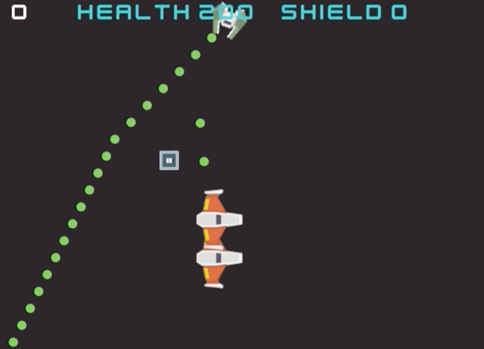
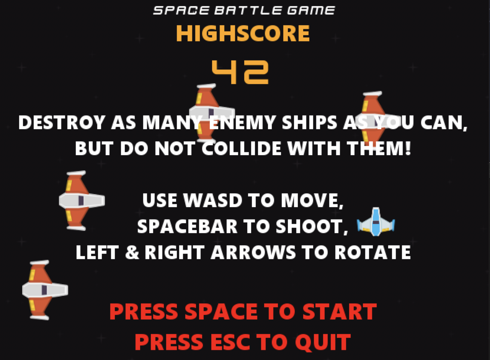

# spaceBattleGame

Here's a topdown shooter game that I made with pygame for Python3.



### Features
- Destroy as many enemy spaceships without getting destroyed yourself! 💯
- Collect health, shield, and damage crates to survive longer! ❤️
- Don't collide with the other spaceships! Lookup for the massive UFO 👾
- Beat your friend's highscores! 🏆

### Prerequisites
- python-3.7+
- pygame-1.9.4 for python-3.7

### Depedancy Installation
```
pip install pygame
```

### How to run the game
```
python .\spaceBattleGame.py
```

### Settings
| Key         | Description                                | Default |
|-------------|--------------------------------------------|---------|
| framerate   | Game frame rate in frames per second (fps) | 60      |
| fullscreen  | Whether to run the game in fullscreen      | true    |
| resolutionx | Screen width in pixels                     | 640     |
| resolutiony | Screen height in pixels                    | 480     |
| sound       | on/off volume (planned feature)            | true    |

### Instructions
- WASD controls
- Spacebar to shoot
- Left and right arrows to rotate


Instructions screen and high score

### Planned Features
- Adjust sound level

### Known Issues
- Low FPS when running windows mode on Retina displays

## Thanks
[Kenney](https://www.kenney.nl) for their sprites and sounds

[bxfr](https://www.bfxr.net) for their sound generator

[FreeMusicArchive](https://freemusicarchive.org) for the theme
